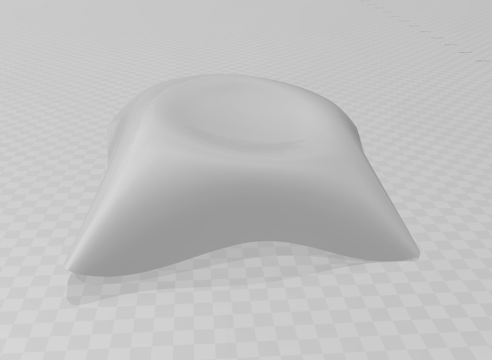

# Unfolding Developable Surfaces
In-depth Assignment for Algorithmic Folding Lecture @ HPI

Within the jupyter notebook [unfold_developable_surfaces.ipynb](https://github.com/chiaojfang/Developable-Surfaces-Unfolding/blob/master/unfold_developable_surfaces.ipynb), a piecewise developable surface can be segmented and unfolded into separated flat pieces.

Building on top of edge unfolding, vertices with non-zero gaussian curvature are identified as cuts and edges on the dual graph of the mesh is updated accordingly. The unfolding would then be performed by traversing each component of the graph with breadth-first search.

## Demo
 

Algorithmic folding course - Developable surface
=======

This course is based on efficient C++ libraries binded to python.
The main philosophy is to use `NumPy` arrays as a common interface, making them highly composable with each-other as well as existing scientific computing packages.

## Installation

The easiest way to install the libraries is trough the [conda](https://anaconda.org/) or [miniconda](https://docs.conda.io/en/latest/miniconda.html) python package manager.

All libraries are part of the channel [conda forge](https://conda-forge.org/), which we advise to add to your conda channels by:
```bash
conda config --add channels conda-forge
```
This step allows to install any conda forge package simply with `conda install <package>`.

To install all our packages just run:
```bash
conda install igl
conda install meshplot
conda install jupyter
```

**Note 1**: that you can install only the ones you need.

**Note 2**: in case of problem we advise to create a new conda environment `conda create -n <name>`.

**Note 3**: if problem persist or your want you feature please post issues on the github bugtracker of each library or [here](https://github.com/geometryprocessing/geometric-computing-python/issues).

### Packages Description

The two packages have specific functionalities and own website.

- [Meshplot](https://skoch9.github.io/meshplot/): fast 2d and 3d mesh viewer based on `pythreejs`.
- [igl](https://libigl.github.io/): swiss-army-knife of geometric processing functions ([python documentation](https://libigl.github.io/libigl-python-bindings/))

## Developable surfaces

See the jupyter notebook [developable_surfaces.ipynb](https://github.com/HassoPlattnerInstituteHCI/Algorithmic-Folding/blob/developable_surface/developable_surfaces.ipynb).
